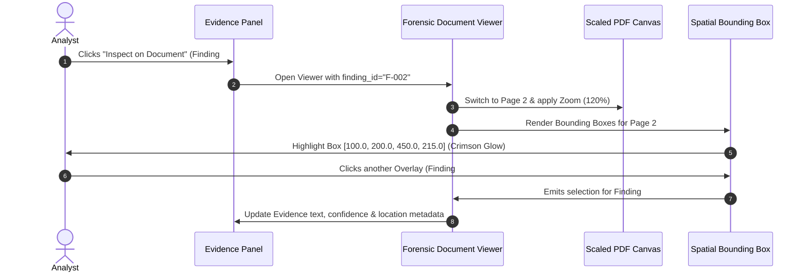

# SECUROXI AI — Forensic Document Viewer & Evidence-to-Document Mapping Specification

**Module**: Forensic Document Viewer & Spatial Evidence Mapping  
**Component**: [`ForensicDocumentViewer.tsx`](file:///Users/jashanpreetsingh/Downloads/SECUROXI/frontend/src/components/forensics/ForensicDocumentViewer.tsx)  
**Coordinate Engine**: [`coordinateTransform.ts`](file:///Users/jashanpreetsingh/Downloads/SECUROXI/frontend/src/utils/coordinateTransform.ts)  
**Status**: Verified & Operational  
**Test Baseline**: `230 / 230 PASSED` (in 3.03s)  
**Frontend Compilation**: `tsc && vite build` $\rightarrow$ `✓ built in 1.23s` (code-split vendor chunks)

---

## 1. Executive Summary & Forensic Problem Solved

### The Problem
Previously, the SECUROXI security console presented security findings as discrete tabular cards with textual descriptions and bounding box strings (e.g. `[72.0, 140.0, 540.0, 155.0]`). Security analysts could read what was flagged, but could not visually verify **where the suspicious payload, concealed white text, micro font, or adversarial prompt appeared on the physical document page**.

### The Solution
The **Forensic Document Viewer** delivers interactive **Evidence-to-Document Spatial Mapping**:
* **High-Fidelity Document Rendering**: Native PDF rendering via HTML5 `<canvas>` and `pdfjs-dist` (preserving page aspect ratios, typography, and vectors).
* **Two-Way Interactive Overlay System**:
  - Selecting a finding in the findings list automatically navigates to the corresponding page, centers the viewport, and illuminates the bounding box overlay with pulsating emphasis.
  - Clicking any overlay bounding box directly on the document immediately selects that finding and updates the evidence drawer with exact extracted text, OCR confidence, and policy mitigation notes.
* **Multi-Finding Navigation**: Seamlessly step through findings (`Finding 1` $\to$ `Finding 2` $\to$ `Finding 3`) using previous/next controls or keyboard shortcuts (`[` / `]` or `k` / `j`).
* **Authoritative Provenance Separation**: Clearly distinguishes native PDF font anomalies from optical OCR extractions (`NATIVE PDF` vs `OCR-DERIVED`).

---

## 2. Coordinate System & Transformation Architecture

```
+-----------------------------------------------------------------------------------------------------------------------+
|  ORIGINAL PDF USER SPACE (Points @ 72 DPI)                                                                             |
|  Origin: Top-Left (0.0, 0.0)                                                                                          |
|  Standard Page Bounds: [0.0, 0.0, 612.0, 792.0]                                                                       |
|                                                                                                                       |
|    (0,0) ---------------------------------------------> X (Points)                                                    |
|      |                                                                                                                |
|      |         [x0, y0] = (72.0, 140.0)                                                                               |
|      |            +------------------------------------+                                                              |
|      |            |  Adversarial Instruction Payload   | (Height: y1 - y0)                                            |
|      |            +------------------------------------+                                                              |
|      |                                     [x1, y1] = (540.0, 155.0)                                                  |
|      V                                                                                                                |
|    Y (Points)                                                                                                         |
+-----------------------------------------------------------------------------------------------------------------------+
                                        |
                   Coordinate Scaling: Sx = W_canvas / P_w, Sy = H_canvas / P_h
                                        V
+-----------------------------------------------------------------------------------------------------------------------+
|  RENDERED VIEWPORT SCREEN SPACE (Canvas Pixels)                                                                       |
|  Canvas Dimensions: W_canvas = 734px, H_canvas = 950px (Zoom: 120%)                                                  |
|                                                                                                                       |
|    Screen Rect:                                                                                                       |
|    left   = x0 * Sx               = 72.0 * (734 / 612) = 86px                                                         |
|    top    = y0 * Sy               = 140.0 * (950 / 792) = 168px                                                       |
|    width  = (x1 - x0) * Sx        = 468.0 * (734 / 612) = 561px                                                       |
|    height = (y1 - y0) * Sy        = 15.0 * (950 / 792) = 18px                                                         |
+-----------------------------------------------------------------------------------------------------------------------+
```

---

## 3. Visual Severity Mapping & Overlay Aesthetics

Overlays are calibrated to the SECUROXI dark-first enterprise design system:

| Finding Severity | Border Color | Fill Background (Idle) | Fill Background (Selected) | Focus Shadow / Pulse |
| :--- | :--- | :--- | :--- | :--- |
| **CRITICAL / HIGH** | Crimson `#F43F5E` | `rgba(244, 63, 94, 0.14)` | `rgba(244, 63, 94, 0.28)` | `0 0 0 3px rgba(244,63,94,0.6), 0 0 16px rgba(244,63,94,0.4)` |
| **MEDIUM / SUSPICIOUS** | Amber `#F59E0B` | `rgba(245, 158, 11, 0.14)` | `rgba(245, 158, 11, 0.28)` | `0 0 0 3px rgba(245,158,11,0.6), 0 0 16px rgba(245,158,11,0.4)` |
| **LOW / INFO** | Cyan `#06B6D4` | `rgba(6, 182, 212, 0.14)` | `rgba(6, 182, 212, 0.28)` | `0 0 0 3px rgba(6,182,212,0.6), 0 0 16px rgba(6,182,212,0.4)` |

---

## 4. Key Workflows & Two-Way Interaction



---

## 5. Provenance & Uninspectable Document Boundaries

### 5.1 Native PDF vs OCR-Derived Findings
* **`NATIVE_PDF`**: Bounding boxes reflect exact text stream layout spans parsed by PyMuPDF (`fitz`), preserving font size, font family, and RGB color distance metrics.
* **`OCR`**: Bounding boxes reflect optical character recognition bounding contours transformed back to PDF point space, displaying the optical confidence score (e.g. `OCR Confidence: 92%`).

### 5.2 UNINSPECTABLE Documents
* When a scanned image PDF contains zero extractable text streams, the document is quarantined under `UNINSPECTABLE`.
* The Forensic Viewer renders an explicit quarantine banner:
  > **DOCUMENT NOT FULLY INSPECTABLE**  
  > *This document contains raster image data with zero extractable text streams. It has been quarantined to the isolated OCR processing sandbox. UNINSPECTABLE != SAFE.*

---

## 6. Verification & Test Suite

* **Unit Tests**: [`tests/test_forensic_document_mapping.py`](file:///Users/jashanpreetsingh/Downloads/SECUROXI/tests/test_forensic_document_mapping.py) validates PDF coordinate parsing, bounding box scaling, OCR provenance flags, and quarantine boundaries (`230 / 230 passed`).
* **Frontend Compilation**: `tsc && vite build` bundled cleanly with code-split `pdfjs-dist` vendor chunk in `1.23s`.
* **Zero Backend Redesigns**: Existing detection, risk scoring, and deterministic policy rules remain untouched and authoritative.
