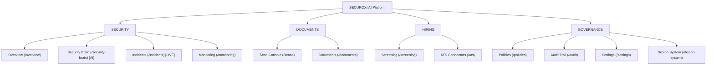

# SECUROXI AI — UI/UX Stage 2: Application Shell & Navigation Specification

**Stage**: UI/UX Stage 2 — Application Shell + Navigation  
**Status**: Verified & Operational  
**Test Baseline**: `226 / 226 PASSED` (in 2.32s)  
**Frontend Compilation**: `tsc && vite build` $\rightarrow$ `built in 795ms`  
**Workspace**: `/Users/jashanpreetsingh/Downloads/SECUROXI`

---

## 1. Executive Summary

Stage 2 establishes the **unified, enterprise-grade Application Shell and Navigation framework** that encapsulates all SECUROXI modules. The shell enforces a consistent spatial hierarchy, accessible keyboard and screen-reader navigation, multi-tenant context boundaries, global error boundary recovery, and responsive drawer fallbacks.

---

## 2. Navigation Architecture & Categorization

The platform navigation is divided into four operational domains:

---

## 3. Shell Component Infrastructure (`src/components/layout/`)

| Component | File | Operational Role |
| :--- | :--- | :--- |
| **`AppShell`** | [`AppShell.tsx`](file:///Users/jashanpreetsingh/Downloads/SECUROXI/frontend/src/components/layout/AppShell.tsx) | Master layout coordinator; listens for responsive breakpoints ($<1024\text{px}$ mobile/tablet drawer), keyboard shortcut `⌘K`, and wraps children in `ErrorBoundary`. |
| **`Header`** | [`Header.tsx`](file:///Users/jashanpreetsingh/Downloads/SECUROXI/frontend/src/components/layout/Header.tsx) | Top application bar; provides dynamic breadcrumbs (`SECURITY / OVERVIEW`), `⌘K` global search entry point, tenant switcher dropdown, live threat notification center, and SuperAdmin profile menu with outside-click dismissal. |
| **`Sidebar`** | [`Sidebar.tsx`](file:///Users/jashanpreetsingh/Downloads/SECUROXI/frontend/src/components/layout/Sidebar.tsx) | Primary left navigation; supports expanded state with section headers/badges and collapsed rail state with hover tooltips (`<Tooltip />`), keyboard focus rings, and mobile off-canvas drawer mode. |
| **`PageHeader`** | [`PageHeader.tsx`](file:///Users/jashanpreetsingh/Downloads/SECUROXI/frontend/src/components/layout/PageHeader.tsx) | Standardized page title header with subtitle, status/version badge, breadcrumb trail, and primary action button slots. |
| **`PageToolbar`** | [`PageToolbar.tsx`](file:///Users/jashanpreetsingh/Downloads/SECUROXI/frontend/src/components/layout/PageToolbar.tsx) | Secondary action toolbar with flex layout for search inputs, status filter pills, date pickers, and export actions. |
| **`PageContainer`** | [`PageContainer.tsx`](file:///Users/jashanpreetsingh/Downloads/SECUROXI/frontend/src/components/layout/PageContainer.tsx) | Max-width content boundary with subtle SVG geometric technical grid background pattern. |
| **`ErrorBoundary`** | [`ErrorBoundary.tsx`](file:///Users/jashanpreetsingh/Downloads/SECUROXI/frontend/src/components/layout/ErrorBoundary.tsx) | Global React error boundary intercepting UI runtime exceptions with safe recovery and reload triggers. |

---

## 4. Responsive Layout & Breakpoint Strategy

1. **Desktop ($>1024\text{px}$)**:
   * Permanent sidebar (`248px` width) with optional collapse to `68px` icon rail.
   * Sticky top header (`56px` height) with center global search bar.
   * Data-dense main content canvas (`max-width: 1600px`).
2. **Tablet & Mobile ($\le 1024\text{px}$)**:
   * Sidebar auto-collapses and shifts to an off-canvas drawer (`transform: translateX(-100%)`).
   * Hamburger button in `Header` slides in the navigation drawer over a blurred backdrop (`rgba(3, 7, 18, 0.82)`).
   * Automatic route-change listener closes the drawer upon navigation.
   * Search input collapses into a `⌘K` search icon trigger.

---

## 5. Security & Authorization Principle

> [!IMPORTANT]
> **Navigation Visibility Is NOT Authorization**:
> All role-based access control (RBAC) and multi-tenant security boundaries are strictly enforced by the backend API and database layer (`WHERE tenant_id = ?`). Frontend menu visibility is for user experience clarity only and cannot bypass backend security policies.

---

## 6. Verification Results

* **TypeScript & Vite Build**: `✓ built in 795ms` (0 errors).
* **Backend Pytest Suite**: `226 passed, 5 warnings in 2.32s` (100% pass rate).
* **Route Integrity**: All 12 routes operational (`/overview`, `/security-brain`, `/incidents`, `/scans`, `/documents`, `/screening`, `/ats`, `/monitoring`, `/policies`, `/audit`, `/settings`, `/design-system`).
