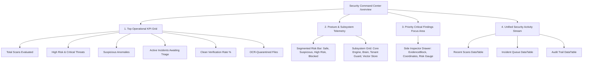

# SECUROXI AI — UI/UX Stage 3: Security Overview Command Center Specification

**Stage**: UI/UX Stage 3 — Security Overview Dashboard  
**Status**: Verified & Operational  
**Test Baseline**: `226 / 226 PASSED` (in 2.38s)  
**Frontend Compilation**: `tsc && vite build` $\rightarrow$ `built in 792ms`  
**Route**: `/overview` (Component: [`OverviewPage.tsx`](file:///Users/jashanpreetsingh/Downloads/SECUROXI/frontend/src/pages/Overview.tsx))

---

## 1. Executive Summary & Operational Goals

The `/overview` dashboard has been completely re-architected into the **primary enterprise Security Command Center**. It aggregates live telemetry from the multi-tenant database, scan engines, incident queues, and system health endpoints to answer the five fundamental SOC questions:

1. **What is happening?** $\rightarrow$ Live telemetry stream, scan counts, and multi-format format breakdown.
2. **What is dangerous?** $\rightarrow$ Priority Active Threats card highlighting critical prompt injections, visual deceptions, and high-risk scans.
3. **What requires attention?** $\rightarrow$ Active unresolved incidents and OCR-quarantined uninspectable files.
4. **Is the system healthy?** $\rightarrow$ Platform subsystem telemetry matrix reporting core API, vector retrieval, and tenant isolation status.
5. **What changed recently?** $\rightarrow$ Unified Security Activity Stream with tabbed data tables for scans, incidents, and audit logs.

---

## 2. Information Architecture & Key Sections

---

## 3. Real Backend Data Integrations

No artificial or hardcoded metrics are displayed. The dashboard connects in parallel to authoritative backend APIs:

| Metric / Section | Source API Endpoint | Data Model Fields |
| :--- | :--- | :--- |
| **Scans & Verdicts** | `GET /api/v1/scans` | `scan_id`, `filename`, `document_type`, `verdict`, `risk_score`, `findings[]`, `created_at` |
| **Security Incidents** | `GET /api/v1/incidents` | `incident_id`, `attack_type`, `affected_asset`, `severity`, `status`, `evidence` |
| **Audit Logs** | `GET /api/v1/audit/logs` | `log_id`, `event_type`, `tenant_id`, `user_id`, `details`, `timestamp` |
| **System Health** | `GET /api/v1/health` | `status`, `version`, `database`, `event_bus` |

---

## 4. Deep Forensic Inspection Drawer

Clicking **"Inspect Forensics"** on any threat or scan row slides in the forensic investigation drawer ([`Drawer.tsx`](file:///Users/jashanpreetsingh/Downloads/SECUROXI/frontend/src/components/ui/Drawer.tsx)), presenting:
* **Calibrated Risk Gauge** (0–100 numerical score with dynamic threshold color mapping).
* **Executive Assessment Summary**.
* **Extracted Evidence Spans**:
  * Exact malicious payload snippet in monospace codeblock.
  * One-click copy-to-clipboard action.
  * Detection engine name (e.g. `PromptInjectionDetector`, `VisualDeceptionDetector`).
  * Confidence score (e.g. `99%`).
  * Page number and span coordinate bounding boxes.
  * Threat explanation and root-cause rationale.

---

## 5. Verification & Quality Assurance

* **TypeScript & Vite Build**: `✓ built in 792ms` with zero compiler errors.
* **Backend Pytest Suite**: `226 passed, 5 warnings in 2.38s` (100% pass rate).
* **Responsive Layout**: Fluid grid adapting from 6-column desktop KPI display to 2-column tablet/mobile view.
* **Honest Empty State**: Zero fake telemetry generated when no scans/incidents exist; displays verified clean status.
