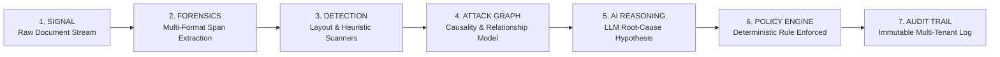

# SECUROXI AI — UI/UX Stage 4: Security Brain Workspace Specification

**Stage**: UI/UX Stage 4 — Security Brain Experience  
**Status**: Verified & Operational  
**Test Baseline**: `226 / 226 PASSED` (in 2.34s)  
**Frontend Compilation**: `tsc && vite build` $\rightarrow$ `built in 785ms`  
**Route**: `/security-brain` (Component: [`SecurityBrainPage.tsx`](file:///Users/jashanpreetsingh/Downloads/SECUROXI/frontend/src/pages/SecurityBrain.tsx))

---

## 1. Executive Summary & Philosophy

The **Security Brain Workspace** is the core cognitive center of the SECUROXI platform. It visualizes the complete forensic flow from raw incoming payload signals to deterministic mitigation rules.

Importantly, it enforces strict **authority separation**:
* **The LLM / AI Reasoning Layer is strictly an ADVISORY analysis tool** explaining adversary intent.
* **The Deterministic Policy Engine is the FINAL AUTHORITATIVE DECISION MAKER** enforcing document quarantine, candidate disqualification, and SIEM alerting.

---

## 2. Core Forensic & Reasoning Flow



---

## 3. Workspace Architecture (3-Column Layout)

| Workspace Column | Component Role | Key Interactions |
| :--- | :--- | :--- |
| **LEFT: Correlated Findings Stream** | Scrollable list of active incidents and suspicious/high-risk scans with real-time risk scores and severity pills. | Live search/filter by threat vector, one-click selection of target threat chain. |
| **CENTER: Attack Graph & Workspace Canvas** | Interactive SVG threat attack graph with vector node relationships (`ACTOR` $\to$ `ARTIFACT` $\to$ `SIGNAL` $\to$ `TECHNIQUE` $\to$ `TARGET` $\to$ `IMPACT`). | Node selection, pan/zoom controls, connection inspection, and chronological execution timeline. |
| **RIGHT: Forensic Authority & Decision Triad** | 3-layer partitioned inspection panel clearly separating evidence, AI advisory notes, and policy execution. | Copy-to-clipboard code evidence, confidence scoring, rule name inspection, and mitigation actions. |

---

## 4. The Decision Triad Breakdown

```
+-------------------------------------------------------------------------+
|  LAYER 1: DETERMINISTIC FORENSIC FINDING [VERIFIED]                     |
|  - Threat Type: INDIRECT_PROMPT_INJECTION                               |
|  - Risk Score: 95 / 100                                                 |
|  - Detector: PromptInjectionDetector (Confidence: 99%)                  |
|  - Exact Monospace Code Snippet with Copy Action                        |
+-------------------------------------------------------------------------+
|  LAYER 2: AI ADVISORY REASONING [ADVISORY NOTE]                         |
|  - LLM Hypothesis: Adversary attempted instruction reset boundary break|
|  - Intent: Force 100/100 candidate score & exfiltrate API keys.         |
|  - Non-Authoritative: Heuristics provide contextual insight only.       |
+-------------------------------------------------------------------------+
|  LAYER 3: ENFORCED POLICY DECISION [FINAL AUTHORITY]                    |
|  - Enforced Rule: RULE-100-HIGH-RISK-BLOCK                              |
|  - Action Executed: [BLOCKED] (Quarantined)                             |
|  - Automated Mitigations: QUARANTINE_PAYLOAD, DISPATCH_SIEM_EVENT       |
+-------------------------------------------------------------------------+
```

---

## 5. Verification & Quality Assurance

* **TypeScript & Vite Build**: `✓ built in 785ms` (0 errors).
* **Backend Pytest Suite**: `226 passed, 5 warnings in 2.34s` (100% pass rate).
* **Interactive Attack Graph**: Interactive zoom controls, responsive SVG scaling, and dynamic node attribute inspection.
