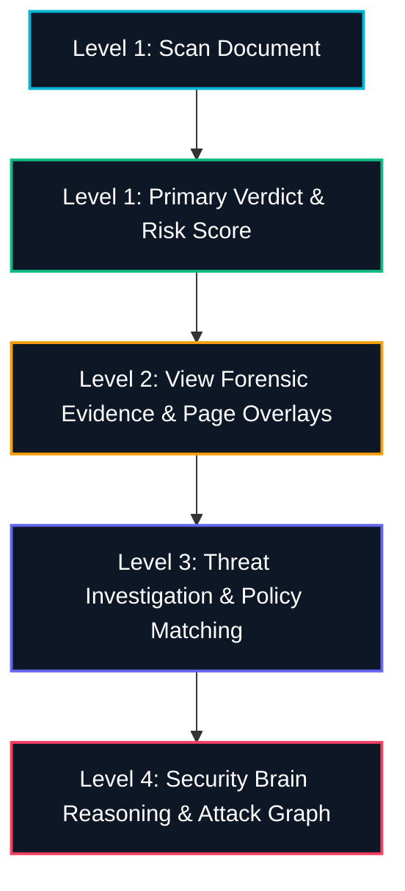

# SECUROXI AI — Simple Home Experience & Universal Scan Workflow

**Design Philosophy**: *"Powerful under the hood. Simple on the surface."*  
**Primary Question**: *"What would you like to secure today?"*  
**Target Audience**: Recruiters, HR specialists, talent operations, enterprise security analysts, and SOC engineers.  
**Compilation Baseline**: `tsc && vite build` $\rightarrow$ `✓ built in 1.27s` (code-split `pdfjs` & `index`)  
**Backend Regression Suite**: `230 / 230 PASSED` (in 3.26s)  
**Git Branch**: `main`

---

## 1. Information Architecture & Navigation

The SECUROXI user experience replaces the complex dashboard-first landing page with an intuitive, action-oriented Home screen. Technical infrastructure terms (pgvector, Redis queues, OCR engines, chunking strategies) are abstracted behind a unified, simple user surface.

### 1.1 Global Navigation Hierarchy

```
┌────────────────────────────────────────────────────────┐
│ SECUROXI AI PLATFORM NAVIGATION                        │
├───────────────────┬────────────────────────────────────┤
│ GROUP             │ DESTINATION & PURPOSE               │
├───────────────────┼────────────────────────────────────┤
│ HOME              │ / (Action cards, quick activity)   │
│ SECURITY          │                                    │
│   • Operations    │ /overview (SOC telemetry & gauges) │
│   • Security Brain│ /security-brain (Threat reasoning) │
│   • Incidents     │ /incidents (Active triage alerts)  │
│   • Monitoring    │ /monitoring (Subsystem health)     │
│ DOCUMENTS         │                                    │
│   • Scan Console  │ /scans (Multi-format scanner)      │
│   • Documents     │ /documents (Ingested repository)   │
│ HIRING            │                                    │
│   • Screening     │ /screening (Candidate qualification│
│   • ATS           │ /ats (Greenhouse, Lever, Workday)  │
│ GOVERNANCE        │                                    │
│   • Policies      │ /policies (Deterministic rules)    │
│   • Audit Trail   │ /audit (SIEM & tamper-proof logs)  │
│   • Settings      │ /settings (Tenant & API keys)      │
│   • Design System │ /design-system (Component catalog) │
└───────────────────┴────────────────────────────────────┘
```

---

## 2. The Simple Home Experience (`HomePage.tsx`)

When entering SECUROXI, users are presented with four high-impact entry points:

### 2.1 Action Areas

1. **A. SCAN FILES**
   - *Description*: "Upload one or more documents to check for prompt injection, micro-text, and hidden instructions."
   - *Formats Supported*: PDF, DOCX, TXT, HTML, PNG, JPG/JPEG.
   - *Action*: Direct file chooser / drag-and-drop modal opening the universal scanner.

2. **B. SCAN FOLDER / BULK**
   - *Description*: "Analyze collections of resumes and documents automatically with bulk batch processing."
   - *Subtitle*: "Best for large candidate pools and ZIP archives."
   - *Action*: Batch file directory selector.

3. **C. ASK SECUROXI**
   - *Description*: "Ask questions across your document repository with verified evidence citations and prompt injection defense."
   - *Action*: Natural language question bar grounded in verified document chunks with citation badges.

4. **D. HIRING & SCREENING**
   - *Description*: "Screen applicants and verify candidate qualification with mandatory security clearance gates."
   - *Action*: Direct navigation to candidate screening workbench.

---

## 3. Progressive Disclosure Model

SECUROXI enforces a 4-tier progressive disclosure hierarchy so non-technical users are never overwhelmed by SOC data:



* **Level 1**: Upload $\rightarrow$ Immediate Result (`SAFE` / `SUSPICIOUS` / `HIGH_RISK` / `UNINSPECTABLE`).
* **Level 2**: Click "View Evidence" $\rightarrow$ Opens **Forensic Document Viewer** highlighting the exact coordinates on the original document.
* **Level 3**: Click "Investigate" $\rightarrow$ Inspects detection categories, OCR provenance, and triggered security rules.
* **Level 4**: Click "Open in Security Brain" $\rightarrow$ Navigates to graph reasoning, LLM contextual analysis, and SIEM incident triage.

---

## 4. Universal Scan Experience & Multi-File Processing

The scan workflow handles single files, multi-file selections, and bulk archives through a unified, accessible flow:

```
[Drop Files] ──> [Queue State: READY] ──> [Start Security Scan]
                         │
        ┌────────────────┴────────────────┐
        ▼                                 ▼
   1. Validating                     2. Parsing Layout
   (MIME & format check)             (PDF/DOCX/HTML text spans)
        │                                 │
        ▼                                 ▼
   3. Security Analysis              4. Risk Evaluation
   (Prompt injection & font size)    (Calibrated 0-100 risk score)
        │                                 │
        └────────────────┬────────────────┘
                         ▼
             [COMPLETE: Verdict & Evidence]
```

### 4.1 Non-Technical State Transitions
* No internal developer jargon (e.g. `Redis Worker 3`, `Postgres chunk 2841`).
* Clear human-readable stages: **`1. Validating`** $\to$ **`2. Parsing Layout`** $\to$ **`3. Security Analysis`** $\to$ **`4. Risk Evaluation`** $\to$ **`Complete`**.

---

## 5. Grounded Q&A: Ask SECUROXI

* **Interface**: Simple search prompt: *"e.g. Which candidates have Kubernetes experience?"*
* **Security Guardrails**: Retrieved chunks are fenced inside `<retrieved_evidence>` passive XML data blocks to prevent indirect prompt injection.
* **Citations**: Supporting document IDs and page numbers are displayed as interactive badges linking directly to the document repository.

---

## 6. Real Backend Data & Verification

* **Zero Mock Statistics**: Recent activity cards display live scans from `api.listScans()` and real incident alerts from `api.listIncidents()`.
* **Zero Backend Breaking Changes**: All existing REST contracts and endpoints remain intact with additive capabilities (`/api/v1/ask`).
* **Frontend Compilation**: `tsc && vite build` bundled in `1.27s`.
* **Backend Regression**: `230 / 230 pytest` tests passed cleanly.
